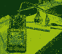

# gbcamera
A simple script to dump [Game Boy Camera](https://en.wikipedia.org/wiki/Game_Boy_Camera) pictures from a save file.



# Usage
Python 3 and Pillow need to be installed.

The save file must have a `.sav` extension and be exactly 128KiB.

```
$ python3 gbcam_dump.py -h
usage: gbcam_dump.py [-h] [--format FORMAT]
                     [--pal {classic,red,inverted,pastel_mix,dark_blue,blue,orange,dark_green,yellow,brown,grayscale,dark_brown,green}]
                     file out_dir

Dump Game Boy Camera pictures from a save file

positional arguments:
  file                  Input file
  out_dir               Output directory

optional arguments:
  -h, --help            show this help message and exit
  --format FORMAT       Output format (defaults to png)
  --pal {classic,red,inverted,pastel_mix,dark_blue,blue,orange,dark_green,yellow,brown,grayscale,dark_brown,green}
```

This will dump all the pictures in the save file, even if they've been deleted in the game.

For more information about the available palettes, look in the [`samples/`](samples/) directory.

# Credits
 * Jeff F. for [documenting](http://www.devrs.com/gb/files/gbcam.txt) the save file structure.
 * [Ilias G.](https://github.com/giech) for fixing the palette values.